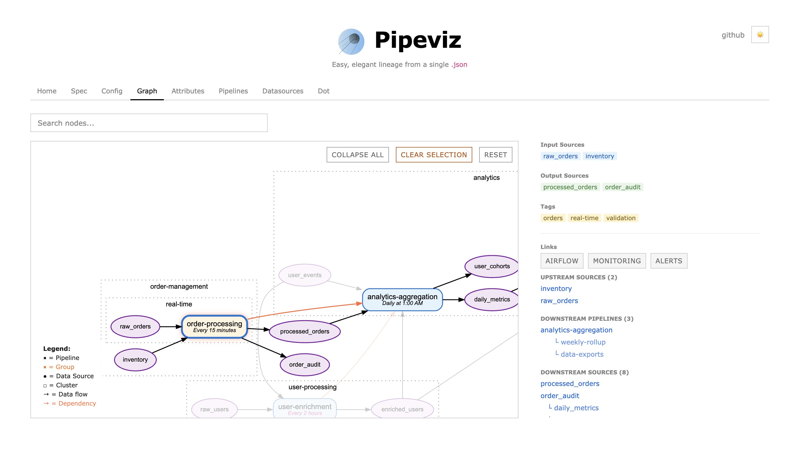
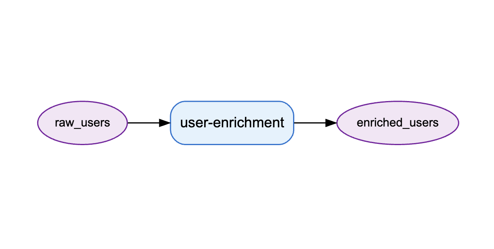

<p align="center">
  
</p>

#  Pipeviz
**Easy, elegant lineage from a single `.json` 🛰️**

A JSON spec for lineage. Declare your pipelines, get a graph.

- One HTML file, no backend, no build step
- Works with any stack: SQL, Spark, Kafka, S3, APIs, shell scripts
- Each team owns their JSON, merge with `jq` for the org-wide view
- Column-level lineage built in

## Why
Declare your immediate dependencies at compile time - the tactical stuff you already know like
"this task reads from A and writes to B". Pipeviz stitches them together into complete end-to-end lineage chains, giving you the strategic big picture for free.

## Quickstart
[Live demo](https://pipeviz.org)

This pipeviz:
```json
{
  "pipelines": [
    {
      "name": "user-enrichment",
      "input_sources": ["raw_users"],
      "output_sources": ["enriched_users"]
    }
  ]
}
```
Renders this:

<p align="center">
  
</p>

## Using
Go to [pipeviz.org](https://pipeviz.org) and paste your JSON, or drag-and-drop a file.

To auto-load a config, use `?url=`:
```
https://pipeviz.org?url=https://yoursite.com/pipeviz.json
```

To self-host, download [pipeviz.html](https://github.com/mattlianje/pipeviz/blob/master/pipeviz.html) and serve it from anywhere.

## Merging Team Configs

Each team maintains their own `pipeviz.json`. Merge them with `jq`:

```bash
# simple merge
jq -s '{
  pipelines: map(.pipelines // []) | add,
  datasources: map(.datasources // []) | add
}' team-*.json > pipeviz.json
```

If teams have pipelines or datasources with the same `name`, last one wins. To keep both, prefix with team name:

```bash
# prefix names with filename to avoid collisions
for f in team-*.json; do
  team=$(basename "$f" .json)
  jq --arg t "$team" '
    .pipelines[]?.name |= "\($t)/\(.)" |
    .datasources[]?.name |= "\($t)/\(.)"
  ' "$f"
done | jq -s '{
  pipelines: map(.pipelines // []) | add,
  datasources: map(.datasources // []) | add
}' > pipeviz.json
```

Or dedupe by name, merging properties from all sources:

```bash
# merge properties for duplicate names
jq -s '{
  pipelines: (map(.pipelines // []) | add | group_by(.name) | map(add)),
  datasources: (map(.datasources // []) | add | group_by(.name) | map(add))
}' team-*.json > pipeviz.json
```

## Motivation
Large polyglot codebases are hard to map. Processes on various linux-boxes in different languages: SQL, Python, shell scripts, etc. Data moving between warehouses, message brokers, APIs. Teams owning pipelines independently without shared runtimes or semantic layers.

There is a central problem: engineers know their pipelines but have no format to declare them (even though they could... and often at compile-time). Instead, separate representations like diagrams in Confluence often spawn, and immediately begin to decay and fall behind once they are created.

Lineage solutions do exist (and will get good results if you buy into their framework and/or World view): **but**...

Current lineage tools ask for **a lot**. [OpenLineage](https://openlineage.io/) and [Marquez](https://marquezproject.ai/) need agents in your cluster, a metadata store, and careful integration with every scheduler. [Atlas](https://atlas.apache.org/#/) wants a full governance platform. [dbt](https://www.getdbt.com/) gives you lineage, but couples you to their manifest and you bend the knee to a framework.

Pipeviz asks for one JSON file.

## Inspiration
- The LISP [code-as-data](https://en.wikipedia.org/wiki/Code_as_data) ethos
- [Data-Oriented Programming](https://www.manning.com/books/data-oriented-programming) by Yehonathan Sharvit
