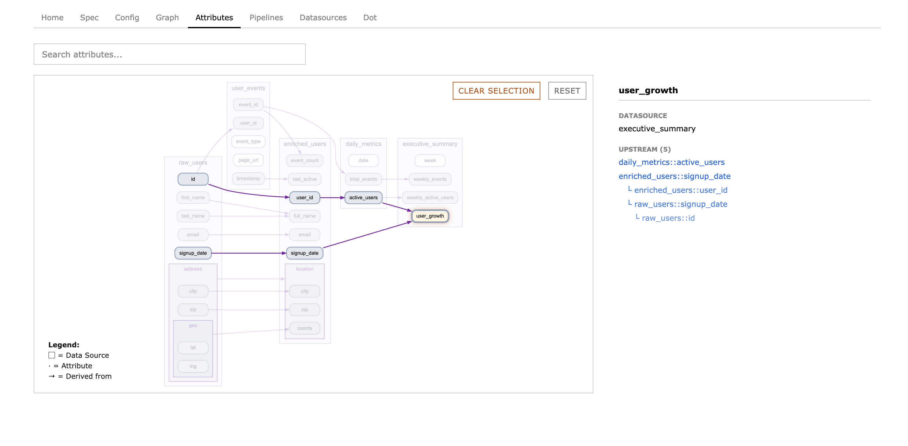
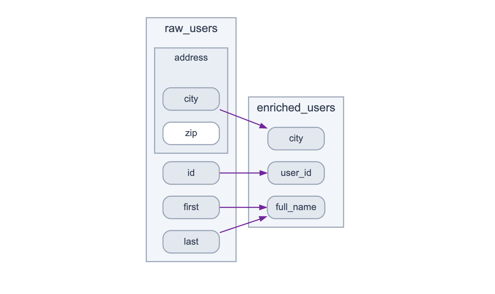
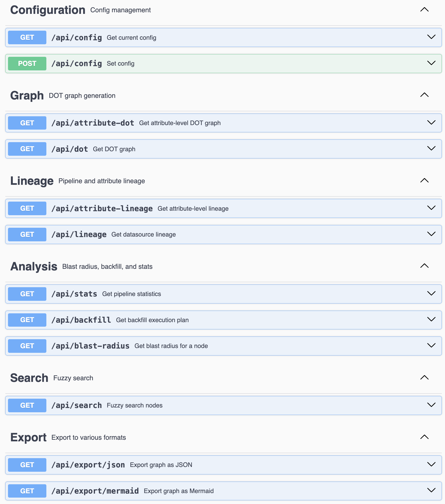

<p align="center">
  
</p>

#  Pipeviz
**Easy, elegant lineage from a single `.json` 🛰️**

A JSON spec for lineage. Declare your pipelines, get a graph.

- No backend required, static hosting
- Works with any stack: SQL, Spark, Kafka, S3, APIs, shell scripts
- Each team owns their JSON, merge with `jq` for the org-wide view
- Column-level lineage built in
- Blast radius to see what breaks
- Backfill stages to parallelize safely

## Why?
When a data org doesn't have a trusted dependency graph:
- **Impact analysis is hard.** You can't trace where bad data came from or what downstream jobs will break.
- **Onboarding is slow.** New hires have no way to see the big picture.
- **Backfills are painful.** No clear order of operations when things need to be re-run.

Current tools have gaps:
- **Runtime instrumentation has a heavy upfront cost** ([OpenLineage](https://github.com/open-metadata/OpenMetadata), [Marquez](https://github.com/MarquezProject/marquez)) needs agents, metadata stores, scheduler integration.
- **Frameworks are brittle** ([dbt](https://github.com/dbt-labs/dbt-core)) couple you to their dialect, manifest, and world view.
- **Manual docs rot** (immediately).

With Pipeviz, you declare your immediate dependencies (preferably) at compile time: "this code reads from A, writes to B". Pipeviz stitches these declarations into complete end-to-end lineage.

## Of note...
Essentially, pipeviz is just a bunch of rendering niceties on top of a plain JSON spec... but this
means you can throw the raw JSON into any LLM and get results.

## Quickstart
[Live demo](https://pipeviz.org)

This pipeviz:
```json
{
  "pipelines": [
    {
      "name": "user-enrichment",
      "input_sources": ["raw_users"],
      "output_sources": ["enriched_users"]
    }
  ]
}
```
Renders this:

<p align="center">
  
</p>

Attribute-level lineage (from the full demo):

<p align="center">
  
</p>

## Usage
Go to [pipeviz.org](https://pipeviz.org) and paste your JSON, or drag-and-drop a file.

To auto-load a config, use `?url=`:
```
https://pipeviz.org?url=https://yoursite.com/pipeviz.json
```

## Attribute Lineage
Track column-level provenance with `::` notation. Supports infinitely nested complex data-types.

- `user_id` derives from a single upstream column
- `full_name` derives from multiple columns (array syntax)
- `city` accesses a nested field via `::` (`address.city` becomes `address::city`)

<p align="center">
  
</p>

<details>
<summary>Full example JSON</summary>

```json
{
   "pipelines": [
      {
         "name": "user-etl",
         "input_sources": [
            "raw_users"
         ],
         "output_sources": [
            "enriched_users"
         ]
      }
   ],
   "datasources": [
      {
         "name": "raw_users",
         "attributes": [
            {
               "name": "id"
            },
            {
               "name": "first"
            },
            {
               "name": "last"
            },
            {
               "name": "address",
               "attributes": [
                  {
                     "name": "city"
                  },
                  {
                     "name": "zip"
                  }
               ]
            }
         ]
      },
      {
         "name": "enriched_users",
         "attributes": [
            {
               "name": "user_id",
               "from": "raw_users::id"
            },
            {
               "name": "full_name",
               "from": [
                  "raw_users::first",
                  "raw_users::last"
               ]
            },
            {
               "name": "city",
               "from": "raw_users::address::city"
            }
         ]
      }
   ]
}
```
</details>

## Merging Team Configs

Each team maintains their own `pipeviz.json`. Merge them with `jq`:

```bash
# simple merge
jq -s '{
  pipelines: map(.pipelines // []) | add,
  datasources: map(.datasources // []) | add
}' team-*.json > pipeviz.json
```

If teams have pipelines or datasources with the same `name`, last one wins. To keep both, prefix with team name:

```bash
# prefix names with filename to avoid collisions
for f in team-*.json; do
  team=$(basename "$f" .json)
  jq --arg t "$team" '
    .pipelines[]?.name |= "\($t)/\(.)" |
    .datasources[]?.name |= "\($t)/\(.)"
  ' "$f"
done | jq -s '{
  pipelines: map(.pipelines // []) | add,
  datasources: map(.datasources // []) | add
}' > pipeviz.json
```

Or dedupe by name, merging properties from all sources:

```bash
# merge properties for duplicate names
jq -s '{
  pipelines: (map(.pipelines // []) | add | group_by(.name) | map(add)),
  datasources: (map(.datasources // []) | add | group_by(.name) | map(add))
}' team-*.json > pipeviz.json
```

## What you get from the graph

- Topological sort into parallel stages for backfills
- Cycle detection
- Diamond dependency handling
- Blast radius analysis (downstream impact)
- Mermaid export
- MCP-ready JSON graph for LLM tooling

## API

There's an optional Clojure web-server if you want programmatic access to the graph...

This is especially useful for cases where you want to let other people routinely "get answers" from your graph ("what would break if?", "what is
downstream of that?") without poking digging into a UI.


<p align="center">
  
</p>

## Why Clojure?

- Pipeviz, like Clojure has the code-as-data philosophy.
- No required persistence layer. Since Clojure is [homoiconic](https://en.wikipedia.org/wiki/Homoiconicity) you can REPL into, poke at, update, define listeners and hooks on your graph 
without having to restart your server or drop-down into the relational algebra of CRUD apps and ORM's. Your graph becomes very easy to extend, almost like a living organism.

## Inspiration
- The LISP [code-as-data](https://en.wikipedia.org/wiki/Code_as_data) ethos
- [Data-Oriented Programming](https://www.manning.com/books/data-oriented-programming) by Yehonathan Sharvit
