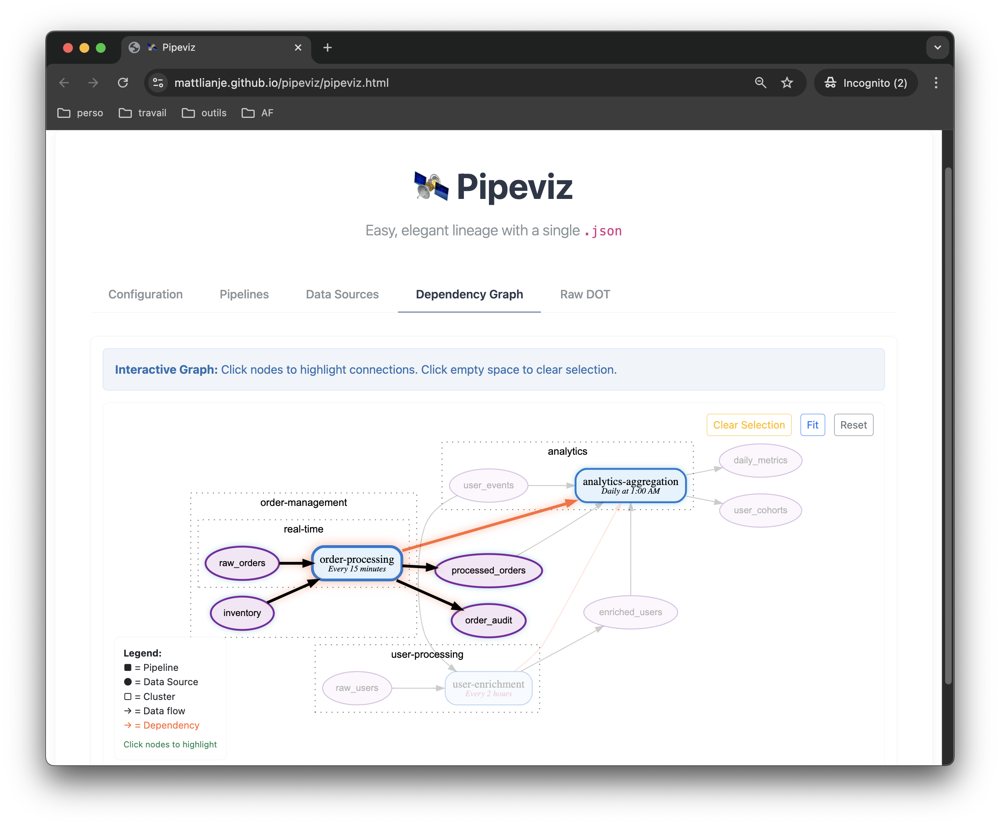
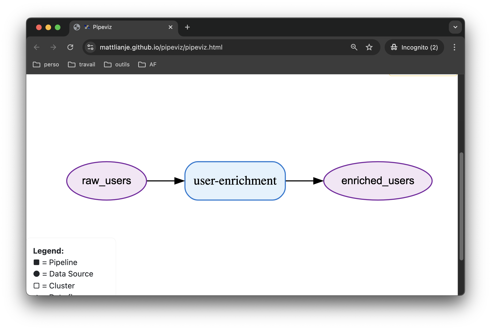

<p align="center">
  
</p>

# Pipeviz
**Easy, elegant lineage with a single `.json` 🛰️**

Pipeviz is a minimal, declarative JSON spec for describing your data systems (see the Spec tab in the [live demo](https://mattlianje.github.io/pipeviz/pipeviz.html)).

Give it a `.json` and you instantly get:
- A dependency graph ([DOT](https://graphviz.org/doc/info/lang.html))
- A full microfrontend UI
- A clear, unified map of your data system
- Attribute-level lineage


## Features
- Declarative, data-as-code lineage
- One file UI (`pipeviz.html`) - no installs, no backend
- Framework-agnostic - not tied to Airflow, dbt, Spark, or vendor tools
- Works across SQL, Delta, Kafka, S3, APIs… **_any_** stack, any language (just JSON)
- Merge `.json` files from multiple teams for the big picture
- No runtime hooks, agents, or daemons
- Separate visualization for column-level lineage

## Quickstart
Try it live 👉 [HERE](https://mattlianje.github.io/pipeviz/pipeviz.html)

This pipeviz:
```json
{
  "pipelines": [
    {
      "name": "user-enrichment",
      "input_sources": ["raw_users"],
      "output_sources": ["enriched_users"]
    }
  ]
}
```
Renders this:

<p align="center">
  
</p>

## Using & Hosting
Pipeviz is just a single static HTML file (`pipeviz.html`) plus your `.json`.

There's no backend, no build step, no install, open the file in your browser or serve it from anywhere you can host static content.

### Option 1 - Open locally
- Download [pipeviz.html](https://github.com/mattlianje/pipeviz/blob/master/pipeviz.html)
- Save your .json in the same folder.
- Open `pipeviz.html` in your browser.
- Paste your JSON into the "Configuration" tab, or drag-and-drop the file.

### Option 2 - Serve over HTTP
Any static hosting works:
- GitHub Pages, commit pipeviz.html + your pipeviz.json and enable Pages.
- S3 + CloudFront, Netlify, Vercel ... upload both files.
- Your own webserver - put them in `/var/www` or equivalent.

To auto-load your JSON:

```bash
https://yourdomain/pipeviz.html?url=https://yourdomain/pipeviz.json
```
Or inline it in the URL:

```bash
https://yourdomain/pipeviz.html?config=BASE64_ENCODED_JSON
```

### Option 3 - Embed in an internal portal
- Drop the HTML into an `<iframe>` in your docs/wiki tool.
- Preload the JSON via `?url=…` so users see the lineage instantly.

## Merging Team Configs

Each team maintains their own `pipeviz.json`. Merge them with `jq`:

```bash
# simple merge
jq -s '{
  pipelines: map(.pipelines // []) | add,
  datasources: map(.datasources // []) | add
}' team-*.json > pipeviz.json
```

If teams have pipelines or datasources with the same `name`, last one wins. To keep both, prefix with team name:

```bash
# prefix names with filename to avoid collisions
for f in team-*.json; do
  team=$(basename "$f" .json)
  jq --arg t "$team" '
    .pipelines[]?.name |= "\($t)/\(.)" |
    .datasources[]?.name |= "\($t)/\(.)"
  ' "$f"
done | jq -s '{
  pipelines: map(.pipelines // []) | add,
  datasources: map(.datasources // []) | add
}' > pipeviz.json
```

Or dedupe by name, merging properties from all sources:

```bash
# merge properties for duplicate names
jq -s '{
  pipelines: (map(.pipelines // []) | add | group_by(.name) | map(add)),
  datasources: (map(.datasources // []) | add | group_by(.name) | map(add))
}' team-*.json > pipeviz.json
```

## Motivation
Lineage and dataflow-visualization in most modern data stacks are an afterthought - bolted on awkwardly.

[OpenLineage](https://openlineage.io/), [Marquez](https://marquezproject.ai/), and [Atlas](https://atlas.apache.org/#/) generally assume you'll instrument the runtime behaviour of your OS processes, buffer everything into the sockets of a central orchestrator, and accept whatever graph their agents extract.

[dbt](https://www.getdbt.com/) takes a different (and powerful) approach - but still asks you to bend the knee to a framework.
You rewrite your pipelines in **their SQL dialect**, commit to **their manifest format**, and structure your project to fit (and be at the mercy) of **their** expectations.

That might work in theory - but not (easily) in large, polyglot OLAP codebases where:
- DAGs live in Scala, SQL, Python, shell scripts
- Data moves between different databases, warehouses, messages brokers, RPC services and API's
- Teams own pipelines independently, with no shared runtime

Pipeviz is a simple reorientation. It says: **_"You already know your pipelines and tables. Just declare them"_**

Each team owns a `pipeviz.json` that they generate how best they see fit (preferably at compile time) ... you merge them, you get the map.

## Inspiration
- [Data-Oriented Programming](https://www.manning.com/books/data-oriented-programming) by Yehonathan Sharvit
